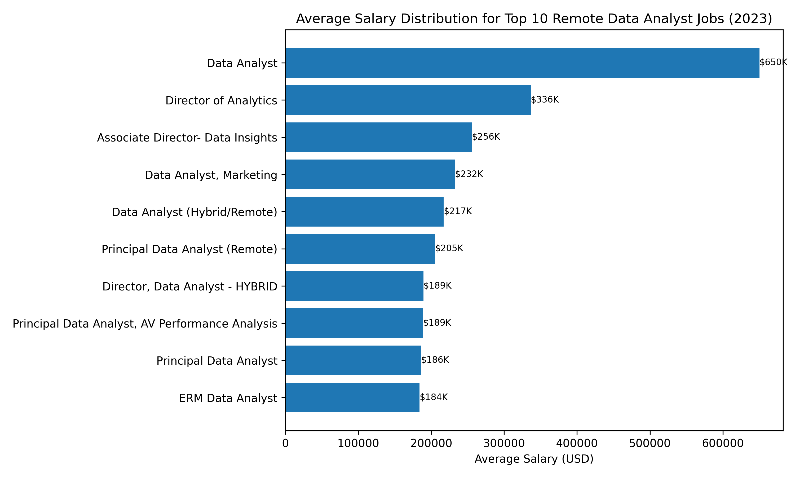
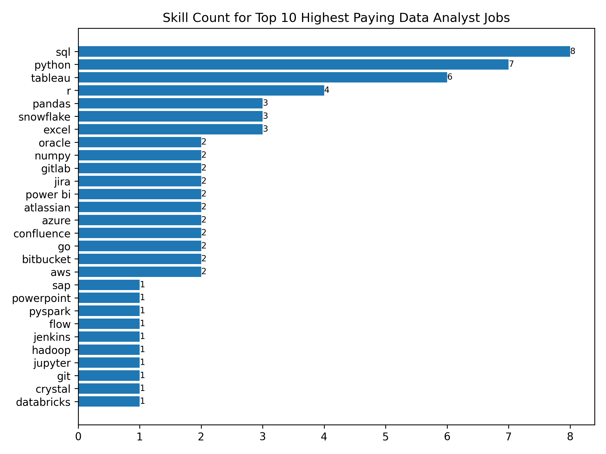
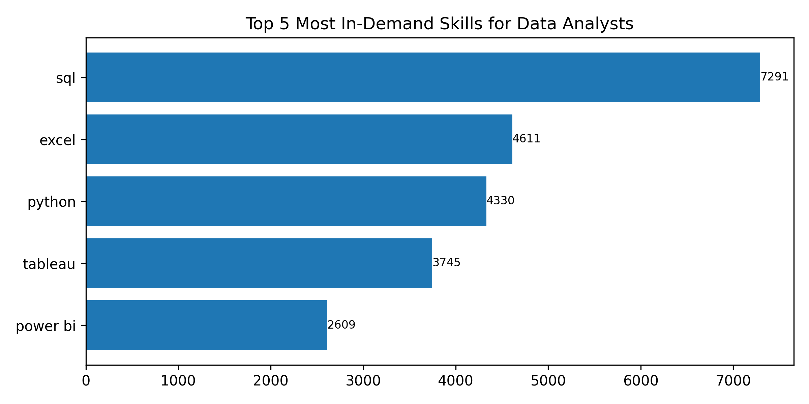
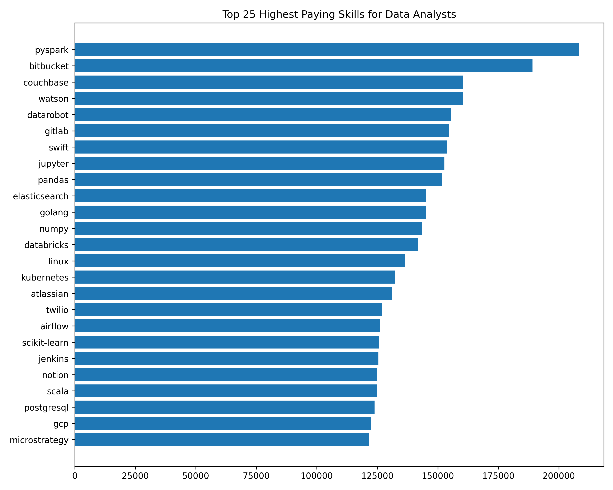
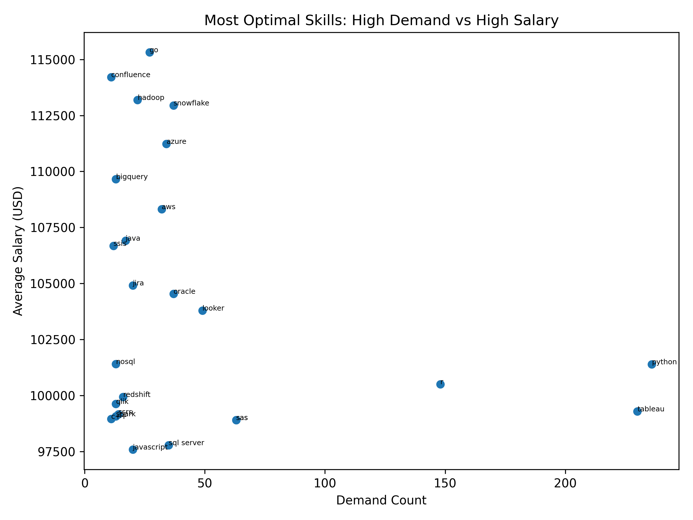

# 📊 SQL Data Job Market Analysis


## 📖 Introduction

This project explores the data analyst job market using SQL and PostgreSQL. By analyzing real-world job posting data, I answered key questions about salary trends, in-demand skills, and the technologies that provide the best career opportunities for aspiring data analysts.

The project demonstrates practical SQL techniques including joins, Common Table Expressions (CTEs), aggregate functions, filtering, grouping, and data analysis to extract meaningful business insights.

---

## 🎯 Project Objectives

The project aims to answer the following questions:

1. What are the highest-paying remote Data Analyst jobs?
2. Which skills are required for these top-paying roles?
3. What are the most in-demand skills for Data Analysts?
4. Which technical skills command the highest salaries?
5. Which skills provide the best balance between demand and salary?

---

## 🗂️ Dataset

The dataset contains thousands of 2023 data job postings, including:

- Job Titles
- Company Information
- Salary Data
- Job Locations
- Required Skills
- Remote Work Availability

The analysis focuses specifically on **Data Analyst** positions.

---

## 🛠️ Tools & Technologies

- **SQL** – Data querying and analysis
- **PostgreSQL** – Database Management System
- **Visual Studio Code** – SQL development environment
- **Git & GitHub** – Version control and project hosting

---

## 1️⃣ Top Paying Data Analyst Jobs

### 🎯 Objective

Identify the highest-paying remote Data Analyst positions with disclosed salaries.

### 💻 SQL Query

```sql
SELECT
    job_id,
    job_title,
    job_location,
    job_schedule_type,
    salary_year_avg,
    job_posted_date,
    name AS company_name
FROM
    job_postings_fact
LEFT JOIN company_dim ON job_postings_fact.company_id=company_dim.company_id    
WHERE
    job_title_short='Data Analyst' AND 
    job_location='Anywhere' AND
    salary_year_avg IS NOT NULL
ORDER BY
    salary_year_avg DESC 
LIMIT 10;    
```

### 📌 Key Insights

* Salaries ranged from approximately **$184K to $650K**, demonstrating the strong earning potential for experienced data analysts.
* High-paying opportunities were available across companies from multiple industries, indicating that competitive salaries extend beyond traditional tech firms.
* Senior and specialized roles, including **Director of Analytics** and **Principal Data Analyst**, consistently appeared among the highest-paying positions.

### 📊 Visualization



*Average annual salary of the top 10 highest-paying remote Data Analyst positions.*

## 2️⃣ Skills Required for Top Paying Jobs

### 🎯 Objective

Identify the technical skills most frequently required for the highest-paying remote Data Analyst positions.

### 💻 SQL Query

```sql
WITH top_paying_jobs AS (
    SELECT
        job_id,
        job_title,
        salary_year_avg,
        name AS company_name
    FROM
        job_postings_fact
    LEFT JOIN company_dim
        ON job_postings_fact.company_id = company_dim.company_id
    WHERE
        job_title_short = 'Data Analyst'
        AND job_location = 'Anywhere'
        AND salary_year_avg IS NOT NULL
    ORDER BY
        salary_year_avg DESC
    LIMIT 10
) 

SELECT top_paying_jobs.*,
    skills
FROM top_paying_jobs
INNER JOIN skills_job_dim ON top_paying_jobs.job_id = skills_job_dim.job_id
INNER JOIN skills_dim ON skills_job_dim.skill_id = skills_dim.skill_id
ORDER BY 
    salary_year_avg DESC
```

### 📌 Key Insights

* **SQL** was required in every top-paying role, making it the most essential skill for high-paying Data Analyst positions.
* **Python** and **Tableau** appeared consistently across premium jobs, highlighting the importance of programming and data visualization.
* Cloud technologies such as **Snowflake**, **Azure**, and **AWS**, along with collaboration tools like **GitLab** and **Bitbucket**, show that employers value analysts with modern data platform experience.

### 📊 Visualization



*Most frequently requested skills across the top 10 highest-paying remote Data Analyst jobs.*

## 3️⃣ Most In-Demand Skills for Data Analysts

### 🎯 Objective

Identify the five most in-demand technical skills across remote Data Analyst job postings.

### 💻 SQL Query

```sql
SELECT 
    skills,
    COUNT(skills_job_dim.job_id) AS demand_count
FROM job_postings_fact
INNER JOIN skills_job_dim
    ON job_postings_fact.job_id = skills_job_dim.job_id
INNER JOIN skills_dim
    ON skills_job_dim.skill_id = skills_dim.skill_id
WHERE 
    job_title_short='Data Analyst' AND
    job_work_from_home=TRUE
GROUP BY 
    skills
ORDER BY 
    demand_count DESC   
LIMIT 5 
```

### 📌 Key Insights

* **SQL** ranked as the most in-demand skill, reinforcing its importance as the foundation of data analytics.
* **Excel**, **Python**, **Tableau**, and **Power BI** were also highly requested, demonstrating the continued demand for data analysis and visualization tools.
* The results show that employers prioritize a combination of database querying, programming, spreadsheet analysis, and business intelligence skills.

### 📊 Visualization



*Top 5 most in-demand technical skills across remote Data Analyst job postings.*

## 4️⃣ Highest Paying Skills

### 🎯 Objective

Identify the technical skills associated with the highest average salaries for remote Data Analyst roles.

### 💻 SQL Query

```sql
SELECT
    skills,
    ROUND(AVG(salary_year_avg),0) AS avg_salary
FROM job_postings_fact
INNER JOIN skills_job_dim
    ON job_postings_fact.job_id = skills_job_dim.job_id
INNER JOIN skills_dim
    ON skills_job_dim.skill_id = skills_dim.skill_id
WHERE
    job_title_short = 'Data Analyst'
    AND salary_year_avg IS NOT NULL
    AND job_work_from_home = TRUE
GROUP BY
    skills
ORDER BY
    avg_salary DESC 
LIMIT 25;
```

### 📌 Key Insights

* **PySpark** ranked as the highest-paying skill, while big data and cloud technologies such as **Databricks**, **Airflow**, and **Kubernetes** also offered premium salaries.
* The **Python ecosystem**, including **Pandas**, **NumPy**, **Jupyter**, and **Scikit-learn**, appeared frequently, reflecting the value of advanced analytics and machine learning skills.
* Modern data engineering and collaboration tools such as **GitLab**, **Bitbucket**, and **Jenkins** were linked to higher-paying roles, indicating that employers value analysts with broader technical expertise.

### 📊 Visualization



*Average salary associated with the top 25 highest-paying technical skills for remote Data Analyst positions.*

## 5️⃣ Most Optimal Skills to Learn

### 🎯 Objective

Identify the skills that offer the best balance between high demand and high average salaries for remote Data Analyst positions.

### 💻 SQL Query

```sql id="95yw4v"
 SELECT
    skills_dim.skill_id,
    skills_dim.skills,
    COUNT(skills_job_dim.job_id) AS demand_count,
    ROUND(AVG(job_postings_fact.salary_year_avg), 0) AS avg_salary
FROM job_postings_fact
INNER JOIN skills_job_dim
    ON job_postings_fact.job_id = skills_job_dim.job_id
INNER JOIN skills_dim
    ON skills_job_dim.skill_id = skills_dim.skill_id
WHERE
    job_title_short = 'Data Analyst'
    AND salary_year_avg IS NOT NULL
    AND job_work_from_home = TRUE
GROUP BY
    skills_dim.skill_id,
    skills_dim.skills
HAVING
    COUNT(skills_job_dim.job_id) > 10
ORDER BY
    avg_salary DESC,
    demand_count DESC
LIMIT 25;
```

### 📌 Key Insights

* **Python**, **SQL**, **Snowflake**, and **Azure** provide an excellent balance between market demand and earning potential, making them valuable skills for aspiring Data Analysts.
* Cloud technologies and modern data platforms consistently appeared among the most rewarding skills, reflecting the industry's shift toward cloud-based analytics.
* Developing a combination of analytical, programming, and cloud skills offers the strongest long-term career prospects in the data analytics field.

### 📊 Visualization



*Technical skills offering the best combination of employer demand and average salary for remote Data Analyst roles.*

---

# 🚀 Skills Demonstrated

This project strengthened my SQL proficiency while improving my ability to analyze real-world datasets and communicate insights through data storytelling.

### SQL Skills

* Complex JOINs
* Common Table Expressions (CTEs)
* Aggregate Functions
* GROUP BY & HAVING
* ORDER BY & LIMIT
* Data Filtering
* Aliasing & Table Relationships

### Analytical Skills

* Exploratory Data Analysis (EDA)
* Salary Trend Analysis
* Skill Demand Analysis
* Business Insight Generation
* Data Storytelling

### Tools & Technologies

* PostgreSQL
* SQL
* Visual Studio Code
* Git & GitHub

---

# 💡 Key Takeaways

* SQL remains the most valuable technical skill for Data Analysts, consistently appearing across both the highest-paying and most in-demand roles.
* Python, Tableau, and cloud technologies significantly enhance career opportunities by complementing traditional analytical skills.
* Big data platforms, cloud services, and collaboration tools are increasingly associated with premium salaries, highlighting the growing overlap between analytics and data engineering.

---

# 🎯 Conclusion

This project demonstrates how SQL can be used to transform raw job posting data into meaningful business insights. By analyzing salary trends, employer demand, and technical skill requirements, I identified the technologies that provide the strongest career opportunities for Data Analysts. Beyond strengthening my SQL proficiency, this project improved my ability to solve business problems, work with relational databases, and communicate findings through clear visualizations and concise insights.

---

## 👨‍💻 About This Project

This project was completed as part of my SQL learning journey to strengthen practical SQL skills using a real-world dataset. Rather than focusing solely on query writing, the project emphasizes transforming raw data into actionable insights through analysis and visualization.

---

## ⭐ If You Found This Project Useful

If you found this project interesting or helpful, feel free to ⭐ star the repository. Feedback and suggestions are always welcome!
